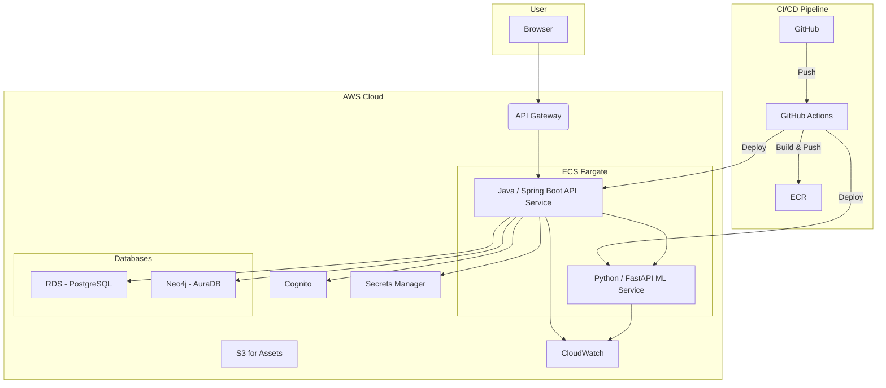

# Bookmarked: A Scalable Book Recommendation Platform

**Bookmarked** is a full-stack, cloud-native web application designed to help readers discover their next favorite book through a rich, personalized experience. It is built with a modern, production-grade tech stack and a sophisticated microservices architecture to demonstrate advanced software engineering principles.

[**Live Demo Coming Soon!**](https://your-live-demo-url.com)

---

## Key Features

* **Dual Recommendation Engines:** Provides recommendations from two distinct sources:
    1.  **ML-Powered "For You"**: A collaborative filtering model (Python/Scikit-learn) that analyzes user ratings to provide broad, personalized suggestions.
    2.  **Graph-Powered "Readers Also Liked"**: A real-time engine (Neo4j) that traverses the user-book graph to instantly show contextual recommendations.
* **Polyglot Persistence Architecture:** Utilizes the best database for the job: **PostgreSQL** for transactional, structured data (users, book metadata) and **Neo4j** for complex, relationship-based data.
* **Secure Authentication:** Seamless and secure user login via Google OAuth2, managed by **AWS Cognito**.
* **Interactive API Documentation:** A live, interactive OpenAPI 3 (Swagger) endpoint for clear, professional API documentation.
* **Production-Ready Operations:** The entire application is containerized with Docker, deployed to **AWS ECS Fargate**, and includes automated CI/CD, monitoring, logging, and secrets management.

## System Architecture

The application is designed as a set of decoupled services that communicate via REST APIs. This architecture ensures scalability, fault tolerance, and separation of concerns.



## Tech Stack & Tools

| Layer               | Technology                                       |
| :------------------ | :----------------------------------------------- |
| **Frontend** | `React` `TypeScript` `Tailwind CSS`              |
| **Backend API** | `Java 21` `Spring Boot 3` `Spring Security`      |
| **ML Service** | `Python 3` `FastAPI` `Scikit-learn` `Pandas`     |
| **Databases** | `PostgreSQL` (Relational) & `Neo4j` (Graph)      |
| **Authentication** | `AWS Cognito` `OAuth2`                           |
| **Cloud & DevOps** | `AWS` (ECS Fargate, RDS, S3, API Gateway)        |
| **CI/CD** | `Docker` `GitHub Actions` `AWS CodeDeploy` `Amazon ECR` |
| **Monitoring** | `AWS CloudWatch` (Logs, Metrics, Alarms)         |
| **API Docs** | `Swagger / OpenAPI 3.0`                          |
| **Testing** | `JUnit 5` `Mockito` `Postman`                    |

## Core Concepts Demonstrated

This project is designed to showcase proficiency in several key areas of modern software development:

* **Microservices Architecture:** Decoupling the main API from the ML model into separate, containerized services.
* **Polyglot Persistence:** Using both relational (SQL) and graph databases and understanding the trade-offs of each.
* **Infrastructure as Code (IaC):** Managing all cloud resources (databases, clusters, etc.) programmatically using the AWS CDK.
* **CI/CD Automation:** Building a complete, automated pipeline from code commit in Git to a live deployment in the cloud.
* **API Design & Documentation:** Creating a clean, well-documented, and professional REST API.
* **Cloud-Native Development:** Building an application from the ground up to leverage the scalability and managed services of a major cloud provider.
* **Observability:** Implementing robust logging, monitoring, and alerting for a production environment.

## API Documentation

The API is fully documented using the OpenAPI 3.0 standard. Once the application is running, interactive Swagger UI documentation is available at:

[`http://localhost:8080/swagger-ui/index.html`](http://localhost:8080/swagger-ui/index.html)

## Running Locally

To run the entire "Bookmarked" platform on your local machine, follow these steps.

### Prerequisites

* Java 21+
* Maven 3.8+
* Node.js 18+
* Docker & Docker Compose
* An AWS account (for Cognito setup) and configured AWS CLI credentials.

### Configuration

1.  **Clone the repository:**
    ```bash
    git clone [https://github.com/your-username/bookmarked.git](https://github.com/your-username/bookmarked.git)
    cd bookmarked
    ```

2.  **AWS Cognito Setup:**
    * Create a User Pool in AWS Cognito.
    * Configure a Google Social Identity Provider.
    * Create an App Client and note the `Client ID` and `Client Secret`.

3.  **Environment Variables:**
    * In the `bookmarked-api` (Spring Boot) directory, create a `.env` file from the `.env.example` template.
    * Populate it with your AWS Cognito details and the default database credentials from the `docker-compose.yml` file.

### Launching the Application

1.  **Start Databases:**
    From the root directory, start the PostgreSQL and Neo4j containers:
    ```bash
    docker-compose up -d
    ```

2.  **Run the ML Service (Python):**
    Navigate to the ML service directory and start the FastAPI server:
    ```bash
    cd bookmarked-ml-service
    pip install -r requirements.txt
    uvicorn main:app --reload
    ```
    The ML service will be available at `http://localhost:8001`.

3.  **Run the Backend API (Java):**
    In a new terminal, navigate to the API directory and run the Spring Boot application:
    ```bash
    cd bookmarked-api
    mvn spring-boot:run
    ```
    The backend API will be available at `http://localhost:8080`.

4.  **Run the Frontend (React):**
    Finally, in another terminal, run the React development server:
    ```bash
    cd bookmarked-frontend
    npm install
    npm run dev
    ```
    The application will be accessible at `http://localhost:5173`.

## Testing

To run the backend test suite and generate a coverage report:

```bash
cd bookmarked-api
mvn clean verify
```

## License

This project is licensed under the MIT License. See the [LICENSE](LICENSE) file for details.